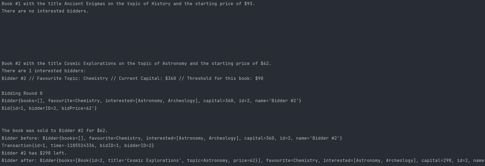
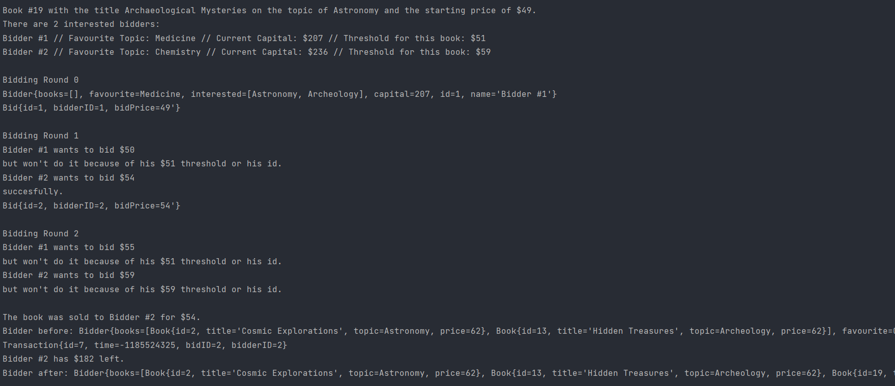
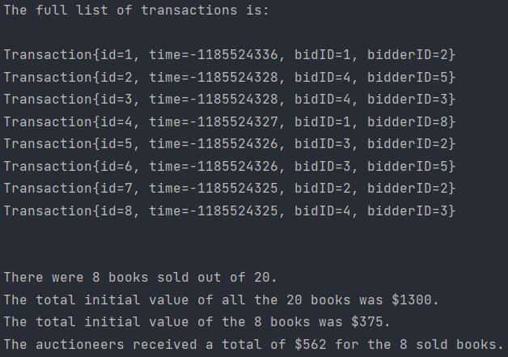

# Java Old Book Auction App

Welcome to the Java Old Book Auction App! This is an application that simulates an old book auction. It creates a set number of books and bidders, each with their own unique properties, and conducts bidding rounds for each book. The application then outputs the transactions that took place. The application was developed as a teamwork study project at Codecool.

## Code Contributors

This project was developed by 

[Teodor-Mihai Marinaș](https://github.com/teodor-marinas/)
[Alexandru Moglan](https://github.com/alexandrumoglan)

## Running the Code 

1. Clone this repository to your local machine

2. Run the `App` class

This will start the old book auction simulation in your console.

## Screenshots

